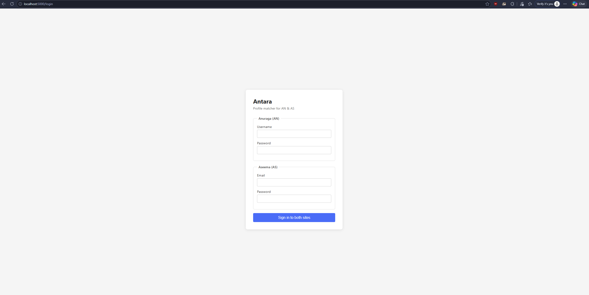
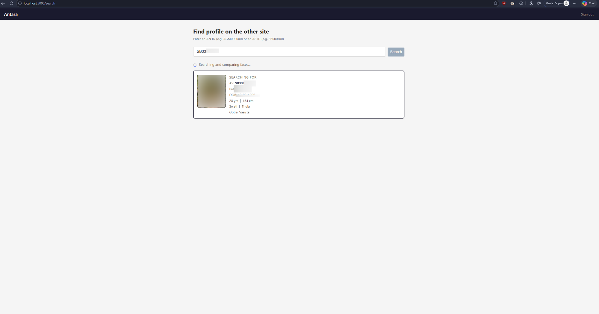
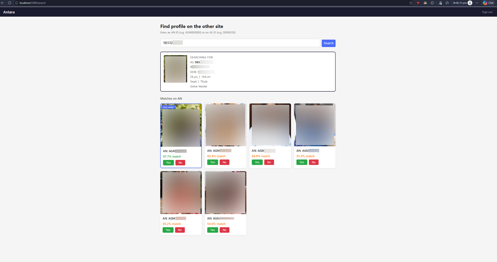
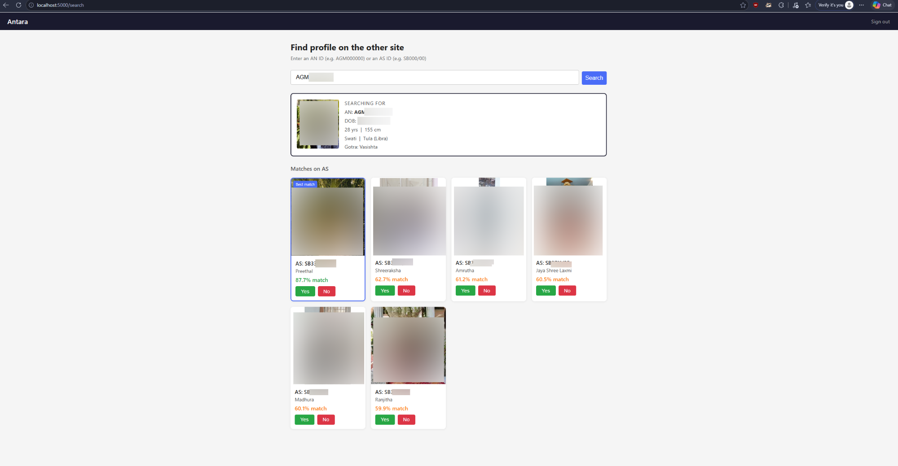

# Antara

Antara is a web app that identifies whether a matrimonial profile on Anuraga Matrimony corresponds to a profile on Aseema Matrimony (and vice-versa).
Just enter an Anuraga or Aseema ID and it will try to get the corresponding profile from the other platform.
It does this getting the details of the source profile, filtering similar profiles in target site, computing face similarity using InsightFace and ranking candidates by facial similarity.
Confirmed matches are saved locally so they are not recomputed on subsequent lookups.

## How it works

1. You enter a profile ID from either site (Anuraga IDs start with `AGM`, e.g. `AGM000000`; Aseema IDs look like `SB000/00`).
2. Antara fetches the source profile and its photos, then searches the other site for candidates with a matching age, height and nakshatra.
3. For each candidate it downloads photos and computes a cosine similarity score between face embeddings.
4. Results are ranked by similarity and displayed in the browser. You can confirm or dismiss each match.


## Requirements

- Python 3.10 or later
- A valid account on both Anuraga Matrimony and Aseema Matrimony


## Installation

Clone the repository and create a virtual environment:

```bash
git clone <repo-url>
cd antara

python3 -m venv venv
source venv/bin/activate

python3 -m pip install -r requirements.txt

python3 app.py
```

The application starts on `http://localhost:5000`. Open it in a browser, enter your Anuraga and Aseema credentials on the login page and then search by profile ID.

> NOTE: The first time the face recognition model is used it will be downloaded automatically by InsightFace (~200 MB).


## Demo

1. Open http://localhost:5000 and login to both Anuraga and Aseema


2. Either enter an Aseema ID and find similar looking Anuraga profiles



3. OR enter an Anuraga ID and find similar looking Aseema profiles


4. Press YES if the match is accurate. This stores the match in DB to avoid duplicate queries in future.


## Handling issues

This app is not production grade and as such has some bugs. In the worst of cases, just remove `antara.db` and the `images/` folder and restart the server.


## Tech stack

| Layer | Technology |
|---|---|
| Web framework | Flask |
| Database | SQLite (via Python's built-in `sqlite3`) |
| Face recognition | InsightFace `buffalo_l` model |
| Model inference | ONNX Runtime (CPU) |
| Image loading | OpenCV, Pillow, pillow-heif |
| Numerical ops | NumPy |
| HTML scraping | BeautifulSoup4, Requests |
| Linting / formatting | Ruff |
| Static type checking | mypy |
| Git hooks | pre-commit |


## Configuration

All tunable values are in `config.py`:

| Variable | Default | Description |
|---|---|---|
| `FACE_SIMILARITY_THRESHOLD` | `0.4` | Cosine similarity above which a candidate is flagged as the same person |
| `TOP_N_RESULTS` | `6` | Number of candidates shown per search |
| `DEFAULT_HEIGHT_MIN_CM` | `152` | Lower bound of height search when a profile has no height listed (5'0") |
| `DEFAULT_HEIGHT_MAX_CM` | `170` | Upper bound of height search when a profile has no height listed (5'7") |
| `REQUEST_TIMEOUT` | `120` | HTTP timeout in seconds for scraper requests |
| `FLASK_SECRET_KEY` | env var | Set via the `FLASK_SECRET_KEY` environment variable in production |

## Project layout

```
antara/
  app.py              Flask application factory
  config.py           Central configuration
  db.py               SQLite database helpers (antara.db)
  jobs.py             Background job runner
  matcher.py          Face embedding and similarity logic
  mappings/           Height and rashi value normalisations between the two sites
  scrapers/           Site-specific scrapers for Anuraga and Aseema
  routes/             Flask blueprints (auth, search, API)
  utils/              Logging setup and session store
  static/             CSS and JavaScript
  templates/          Jinja2 HTML templates
```
